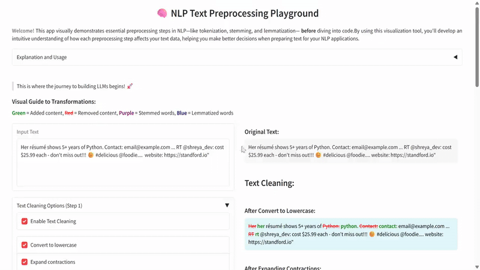
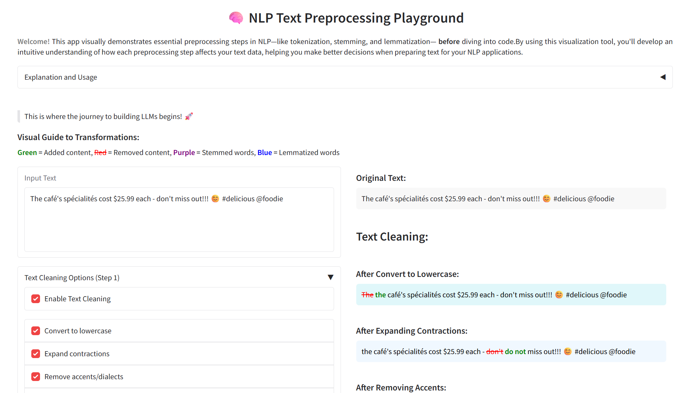

# NLP_Text_Preprocessing_Pipeline_Visualization

<figure style="text-align: center;">
  <a href="https://your-gradio-app-link.com" target="_blank">
    
  </a>
  <figcaption><strong>Figure 1:</strong> This GIF demonstrates the preprocessing pipeline.</figcaption>
</figure>


Check out [Gradio Text Pre-processing App](https://huggingface.co/spaces/ShreyaL/NLP_preprocessing_playground) for Demo.<br>

An interactive Gradio app that demonstrates comprehensive text preprocessing techniques for Natural Language Processing (NLP). Visualize how each preprocessing step transforms your text with color-coded changes and explore tokenization, stemming, and lemmatization in real-time. 

<!-- <figure style="text-align: center;">
  
  <figcaption><strong>Figure 2:</strong> Screenshot of the NLP preprocessing pipeline.</figcaption>
</figure> -->
<p align ="center">
  <br>
  <strong>Figure 2:</strong> Screenshot of the NLP preprocessing pipeline.
</p>


## Key Features
- 10+ Text Cleaning Operations: Lowercasing, contraction expansion, URL removal, accent removal, and more
- Visual Transformation Tracking: Color-coded changes show exactly what each step modifies
- Tokenization & NLP Processing: Stopword removal, stemming, and lemmatization
- Token ID Generation: Create numerical representations of tokens
- Interactive Examples: Pre-loaded examples to demonstrate different transformations
- Educational Resources: Detailed explanations and references for each step

## Installation
1. Clone the repository (Bash command):

```
$ git clone https://github.com/yourusername/ nlp-text-preprocessing.git
$ cd nlp-text-preprocessing
```
2. Create a virtual environment (recommended):

```
$ python -m venv venv
$ source venv/bin/activate  # On Windows: venv\Scripts\activate
```
3. Install dependencies:

```
$ pip install -r requirements.txt
```
4. Running the App
```
$ python app.py
```
The app will launch and provide a local URL (typically http://127.0.0.1:7860) that you can open in your browser.

## Requirements
The app requires the following Python packages:

- gradio
- nltk
- regex
- contractions

All dependencies are listed in the requirements.txt file.

## Usage Guide
1. Enter text in the input box or try the provided examples
2. Configure processing options:
    - Enable/disable text cleaning and its sub-operations
    - Choose NLP processing steps (stopword removal, stemming, lemmatization)
3. Click "Process Text" to see the step-by-step transformations
4. Explore:
    - Green text = Added content
    - Red strikethrough = Removed content
    - Purple = Stemmed words
    - Blue = Lemmatized words

## Example Inputs
Try these sample inputs to see the preprocessing in action:
1. "Check out https://nlp.stanford.edu!!! I've been studying NLP since 2020. @StanfordNLP rocks!"
2. "The café's spécialités cost $25.99 each - don't miss out!!! 😊 #delicious @foodie"
3. "Meeting at 5:30 PM. Please be on time!!! We're excited @team!!!"

## Features Overview
Text Cleaning Options:
- Lowercase conversion
- Contraction expansion
- Accent/dialect removal
- URL removal
- Non-word/non-whitespace character removal
- Punctuation removal
- Digit removal
- Extra whitespace removal
- Repeated punctuation handling
- Twitter handler removal

NLP Processing:
- Tokenization with word highlighting
- Stopword identification and removal
- Stemming (Porter Stemmer)
- Lemmatization (WordNet Lemmatizer)
- Token ID generation and mapping

## Best Practices
- Order Matters: Always lowercase first, remove URLs before punctuation
- Context Awareness: Don't remove numbers if they're meaningful (e.g., product codes)
- Performance: Pre-compile regex patterns for repeated use
- Customization: Adapt cleaning steps to your specific text domain


📌 **Remember**: There's no one-size-fits-all solution. The optimal preprocessing steps depend on your specific use case and text domain. 

## Contributing
Contributions are welcome! Here's how to contribute:
1. Fork the repository
2. Create a new branch (git checkout -b feature/your-feature)
3. Commit your changes (git commit -m 'Add some feature')
4. Push to the branch (git push origin feature/your-feature)
5. Open a pull request

Please ensure your code follows PEP 8 style guidelines and includes appropriate tests.

## License
This project is licensed under the MIT License - see the LICENSE file for details.

## Acknowledgments
- NLTK library for NLP functionality
- Gradio for the interactive interface
- Stanford NLP Group for inspiration and resources

Happy preprocessing! For questions or feedback, please open an issue on GitHub. 

   
